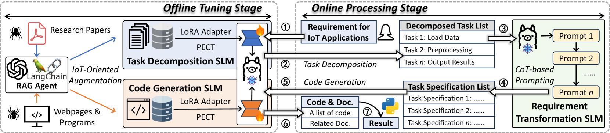

# # GPIoT: Tailoring Small Language Models for IoT Program Synthesis and Development 
- Foundation model: Llama-2-13b-chat-hf
- LoRA fine tuned with INT8 quantization


[](https://lemingshen.github.io/assets/publication/conference/GPIoT/paper.pdf) &ensp; [](https://lemingshen.github.io/projects/gpiot/) &ensp; [](https://opensource.org/licenses/MIT)

Code Large Language Models (LLMs) enhance software development efficiency by automatically generating code and documentation in response to user requirements. However, code LLMs cannot synthesize specialized programs when tasked with IoT applications that require domain knowledge. While Retrieval-Augmented Generation (RAG) offers a promising solution by fetching relevant domain knowledge, it necessitates powerful cloud LLMs (e.g., GPT-4) to process user requirements and retrieved contents, which raises significant privacy concerns. This approach also suffers from unstable networks and prohibitive LLM query costs. Moreover, it is challenging to ensure the correctness and relevance of the fetched contents. To address these issues, we propose GPIoT, a code generation system for IoT applications by fine-tuning locally deployable Small Language Models (SLMs) on IoT-specialized datasets. SLMs have smaller model sizes, allowing efficient local deployment and execution to mitigate privacy concerns and network uncertainty. Furthermore, by fine-tuning the SLMs with our IoT-specialized datasets, the SLMs' ability to synthesize IoT-related programs can be substantially improved. To evaluate GPIoT's capability in synthesizing programs for IoT applications, we develop a benchmark, IoTBench. Extensive experiments and user trials demonstrate the effectiveness of GPIoT in generating IoT-specialized code, outperforming state-of-the-art code LLMs with an average task accuracy increment of 64.7% and significant improvements in user satisfaction.


## AutoIOT Overview



## Quick Start
### 1. Installation
```bash
pip install -r requirements.txt
```

### 2. Dataset Preparation
- Our dataset for task decomposition: [link](https://huggingface.co/datasets/lemingshen/GPIoT_Task_Decomposition).
- Our dataset for code generation: [link](https://huggingface.co/datasets/lemingshen/GPIoT_Code_Generation).


### 3. Model File
- Our fine-tuned model for task decomposition: [link](https://huggingface.co/lemingshen/GPIoT_Task_Decomposition).
- Our fine-tuned model for code generation: [link](https://huggingface.co/lemingshen/GPIoT_Code_Generation).

### 4. IoTBench
- To evaluate LLM's capabilities in generating IoT-related programs, we develop an IoTBench
- You can find download the benchmark here: [link](https://mypikpak.com/s/VOLPPwXhmHBnHMY7hW6oGHjMo1)

### 4. Download Foundation Model
- Download the foundation model of `Llama2-13b-chat-hf` from this [link](https://huggingface.co/meta-llama/Llama-2-13b-chat-hf)
- Make sure that the file structure looks like this:
  ```
  |-- GPIoT
      |-- meta-llama
         |-- Llama-2-13b-chat-hf
            |-- .gitattributes
            |-- config.json
            |-- generation_config.json
            |-- LICENSE.txt
            |-- model.safetensors.index.json
            |-- model-00001-of-00003.safetensors
            |-- ......
  ```

### 5. Perform Task Decomposition
- Modify the `task_decomposition.py` based on you IoT application and requirements
- Directly execute the `task_decomposition.py`

### 6. Perform Code Generation
- Modify the `code_generation.py` based on you IoT application and requirements
- Directly execute the `code_generation.py`

### Please don't hesitate to reach out if you have any questions.

## Citation
```
@inproceedings{shen2024fedconv,
  title={GPIoT: Tailoring Small Language Models for IoT Program Synthesis and Development},
  author={Shen, Leming and Yang, Qiang and Huang, Xinyu and Ma, Zijing and Zheng, Yuanqing},
  booktitle={Proceedings of the 22nd ACM Conference on Embedded Networked Sensor Systems},
  pages={1--14},
  year={2025}
}
```
